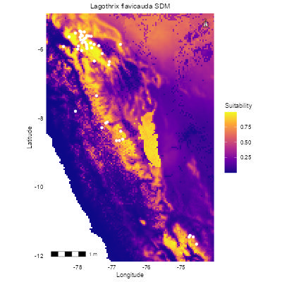
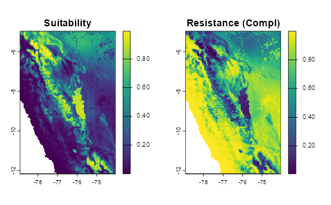
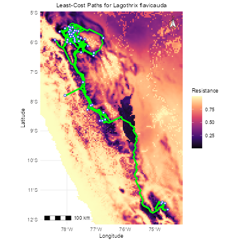

# SDMconnectR

R package for **Species Distribution Modeling (SDM)** and **connectivity analysis**.  
It is designed to model species distributions using generalized linear models (GLM) and environmental predictors, generate pseudo-absence points, and calculate connectivity through least-cost paths.

---

## Installation

```r
# Install devtools if not already installed
install.packages("devtools")

# Install from GitHub
devtools::install_github("joliengr/SDMconnectR")
```

# Functions

The package currently includes:
| Function                      | Description                                                          |
| ----------------------------- | -------------------------------------------------------------------- |
| `generate_pseudo_absence()`   | Create pseudo-absence points based on presence data                  |
| `extract_env()`               | Extract environmental predictor values from raster layers for points |
| `fit_sdm_glm()`               | Fit a binomial GLM-based SDM                                         |
| `predict_sdm_glm()`           | Predict habitat suitability on raster data                           |
| `evaluate_sdm()`              | Evaluate SDM with AUC and optional threshold-based metrics           |
| `cv_sdm_glm()`                | Perform k-fold cross-validation for SDM                              |
| `suitability_to_resistance()` | Convert habitat suitability raster to resistance raster              |
| `calculate_cost_distance()`   | Compute least-cost paths between points using a resistance raster    |


All functions are documented and include example code for testing.

# Example Usage

This package does not include original datasets. All analyses are based on data from published sources cited in the documentation.

The data used in this example is occurence data of Lagothrix flavicauda from GBIF.org (25 March 2026) and Zarate et al. (2023)
The occurence data was preprocessed, thinned to 5km distance and the environmental input data is a stack of the bioclim variables 1,2 and 19, a 30m DEM and the ESA CCI land cover dataset, resampled to 5km resolution. 

Despise certain preprocessing and evaluating the model, which has a mean_AUC = 0.8655556, the analysis has to be considered preliminar an is simply to demonstrate the use of the functions. The quality of the outcome depends highly on the quality of the input data.

```r
abs <- generate_pseudo_absence(
  data = occ,
  x_col = "lon",
  y_col = "lat",
  n = 46,
  min_dist = NULL
)

data_env <- extract_env(
  points = abs,
  raster = env,
  x_col = "lon",
  y_col = "lat"
)

predictors <- c("wc2.1_2.5m_bio_1", "wc2.1_2.5m_bio_2", "wc2.1_2.5m_bio_19", "PER_elv_msk", "lccs_class")

model <- fit_sdm_glm(
  data = data_env,
  response = "presence",
  predictors = predictors
)

eval <- evaluate_sdm(
  model = model,
  data = data_env,
  response = "presence",
  threshold = 0.5
)
```
$AUC
[1] 0.8757089

$ConfusionMatrix
| Predicted \ Observed | 0  | 1  |
|----------------------|----|----|
|          0           | 38 | 7  |
|          1           | 8  | 39 |

```r
cv_results <- cv_sdm_glm(
  data = data_env,
  response = "presence",
  predictors = predictors,
  k = 5,
  threshold = 0.47
)
```

$mean_AUC
[1] 0.8655556  
$sd_AUC
[1] 0.1042102

```r
# Predict Raster over Env-Stack
pred_raster <- predict(env, model, type = "response")

# Convert Raster in data.frame 
df <- as.data.frame(pred_raster, xy = TRUE)
colnames(df) <- c("x", "y", "suitability")
df <- r_df %>% filter(!is.na(suitability))

occ_sf <- st_as_sf(occ, coords = c("lon", "lat"), crs = crs(pred_raster))
occ_df <- st_coordinates(occ_sf) %>% as.data.frame()
colnames(occ_df) <- c("x", "y")

# Plot
ggplot(df) +
  geom_raster(aes(x = x, y = y, fill = suitability)) +
  geom_point(data = occ_df, aes(x = x, y = y), color = "white", size = 1.5) +  
  scale_fill_viridis_c(option = "plasma", name = "Suitability") +
  coord_equal(expand = FALSE) +
  theme_minimal(base_size = 10) +   # Basisgröße kleiner
  theme(
    axis.text = element_text(size = 8, color = "black"),  # Achsentext kleiner
    axis.title = element_text(size = 9),                 # Achsentitel kleiner
    plot.title = element_text(size = 10, hjust = 0.5),   # Titel kleiner + zentriert
    legend.title = element_text(size = 9),
    legend.text = element_text(size = 8),
    panel.grid = element_line(color = "transparent")
  ) +
  labs(
    title = "Lagothrix flavicauda SDM",
    x = "Longitude",
    y = "Latitude"
  ) +
  annotation_north_arrow(
    location = "tr",
    which_north = "true",
    pad_x = unit(0.02, "npc"), pad_y = unit(0.02, "npc"),
    height = unit(0.5, "cm"),  # Höhe des Pfeils
    width = unit(0.5, "cm"),   # Breite des Pfeils
    style = north_arrow_fancy_orienteering(
      text_size = 5,           # Text auch kleiner
      line_col = "black",
      line_width = 0.5,
      fill = "white"
    )
  ) +
  annotation_scale(
    location = "bl",
    width_hint = 0.3,
    text_cex = 0.6,   # Maßstab kleiner
    line_width = 0.5
  )
```
Species Distribution Model 



```r
# Complement Resistance
resistance_comp <- suitability_to_resistance(pred_raster, method = "complement")

# Plot 
par(mfrow = c(1,2))
plot(pred_raster, main = "Suitability")
plot(resistance_comp, main = "Resistance (Compl)")
```

Resistance Map



```r
# calculate least cost distance
lcps <- calculate_cost_distance(
  raster = resistance_comp,
  points = occ,
  x_col = "lon",
  y_col = "lat"
)

# Convert Raster y vector layer for ggplot
res_df <- as.data.frame(resistance_comp, xy = TRUE)
colnames(res_df) <- c("x", "y", "resistance")
res_df <- res_df %>% filter(!is.na(resistance))
occ_sf <- st_as_sf(occ, coords = c("lon", "lat"), crs = crs(resistance_comp))

# Plot
ggplot() +
  # Raster
  geom_raster(data = res_df, aes(x = x, y = y, fill = resistance)) +
  scale_fill_viridis_c(option = "magma", name = "Resistance") +
  
  # Least-cost paths
  geom_sf(data = lcps, color = "green", size = 0.7) +
  
  # Occurrence points
  geom_sf(data = occ_sf, color = "blue", size = 1.5, shape = 21, fill = "white") +
  
  # Koordinaten
  coord_sf(expand = FALSE) +
  
  # Nordpfeil
  annotation_north_arrow(
    location = "tr",
    which_north = "true",
    pad_x = unit(0.02, "npc"), pad_y = unit(0.02, "npc"),
    height = unit(0.8, "cm"),
    width = unit(0.8, "cm"),
    style = north_arrow_fancy_orienteering(
      text_size = 6,
      line_col = "black",
      line_width = 0.5,
      fill = "white"
    )
  ) +
  
  # Maßstab
  annotation_scale(
    location = "bl",
    width_hint = 0.3,
    text_cex = 0.7,
    line_width = 0.5
  ) +
  
  # Layout
  theme_minimal(base_size = 10) +
  labs(
    title = "Least-Cost Paths for Lagothrix flavicauda",
    x = "Longitude",
    y = "Latitude"
  ) +
  theme(
    axis.text = element_text(size = 8),
    axis.title = element_text(size = 9),
    plot.title = element_text(size = 10, hjust = 0.5),
    legend.title = element_text(size = 9),
    legend.text = element_text(size = 8)
  )
```

Least Cost Paths




### Notes
Environmental predictors in examples include climate, elevation, and optionally forest cover.
Random examples in functions are for testing only; replace with real data for actual analyses.
The package is intended for educational and demonstration purposes.

### Literature 
GBIF Occurrence Download  https://doi.org/10.15468/dl.v2akjh 
Zarate, M., Shanee, S., Charpentier, E., Sarmiento, Y., Schmitt, C. (2023), Expanded distribution and predicted suitable habitat for the critically endangered yellow-tailed woolly monkey (Lagothrix flavicauda) in Perú. American Journal of Primatology. https://doi.org/10.1002/ajp.23464

### License
This package is licensed under the MIT License.  
See the LICENSE file for details.
